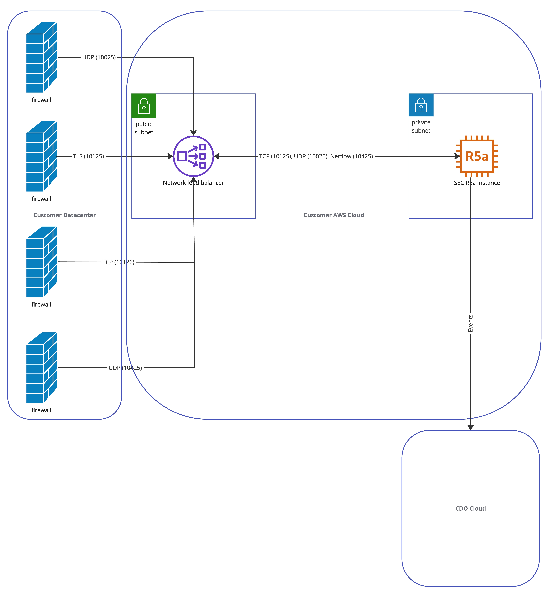

# Secure Event Connector Terraform module

The Secure Event Connector (SEC) is a component of the Cisco Defense Orchestrator (CDO) Security Analytics and Logging (SAL) SaaS solution. It receives events from Adaptive Security Appliance (ASA), Secure Firewall Cloud Native (SFCN) and FDM-managed devices and forwards them to the Cisco cloud. CDO displays the events on the Event Logging page so that administrators can analyze them there or by using Cisco Secure Cloud analytics.

Use this Terraform module if you wish to deploy the SEC in your AWS VPC.

## Learn more

The [CDO documentation](https://docs.defenseorchestrator.com/#!c-secure-event-connectors.html) has more details on SAL and the SEC.

# Pre-requisities
- An AWS account
- An AWS VPC with two public subnets in separate Availability Zones, and one private subnet
- An AWS Route53 Hosted Zone
- Terraform knowledge
- A Cisco Defense Orchestrator Account with Security Analytics and Logging enabled (see the [CDO documentation](https://docs.defenseorchestrator.com/#!g-cisco-security-analytics-and-logging.html))

# Supported Regions

| Region       |
| ------------ |
| us-east-1    |
| us-west-1    |
| eu-west-1    |
| eu-west-2    |
| eu-central-1 |

# Architecture



The SEC is deployed on an R5A AWS instance which is placed behind an AWS Network Load Balancer. While it is possible for you to deploy the SEC in a public subnet, we recommend against it for security reasons (and you will have to perform manual operations such as assigning an IP address and starting up the SEC manually).

You can send events from your firewall to the SEC using TCP and UDP as you have always been able to. But additionally, you can use TLS to secure the events sent through. The NLB will terminate the TLS connection and decrypt the data before passing it through to the SEC.

| Port  | Protocol        |
| ----- | --------------- |
| 10125 | TLS (TCP)       |
| 10126 | TCP (unsecured) |
| 10025 | UDP             |
| 10425 | Netflow         |

## Connecting to your SEC instance

Once this terraform module is applied, the SEC should be up and running. However, you may find that you may need to log in to your instance's shell to perform troubleshooting. For security reasons, we do not expose SSH on the SEC that we deploy. You can use AWS SSM Session Manager to connect. To learn more about how to use SSM to connect to your AWS instance, see [the AWS documentation](https://docs.aws.amazon.com/systems-manager/latest/userguide/session-manager-working-with.html). The instance ID is required to connect, and you can get that from the `instance_id` output of this Terraform module.

# Usage

Please see [the usage documentation](USAGE.md).

## Examples

```
module "acme-corp-us-sec" {
  source                     = "CiscoCdo/sec"
  env                        = "us"
  subnet_id                  = "<private-subnet>"
  public_subnet_id           = "<replace-with-public-subnet>"
  secondary_public_subnet_id = "<replace-with-public-subnet-in-different-az>"
  vpc_id                     = "<replace-with-vpc-id>"
  instance_name              = "acme-corp"
  instance_size              = "r5a.xlarge"
  cdo_bootstrap_data         = "<replace-with-cdo-bootstrap-data-from-cdo>"
  sec_bootstrap_data         = "<replace-with-sec-bootstrap-data-from-cdo>"
  dns_name                   = "<replace-with-dns-name-managed-by->"
  hosted_zone_id             = "<replace-with-hosted-zone-id>"
}
```

# Post-installation: Sending events to your SEC over TLS

## Import certificate

To send events to your SEC over TLS, you need to first import the CA certificate that AWS uses to sign the NLB certificate. To do so, retrieve the `sec_fqdn` output from this Terraform module, and retrieve the certificate chain using the OpenSSL command as follows:
```
openssl s_client -showcerts -verify 5 -connect $SEC_FQDN:10125 < /dev/null | awk '/BEGIN CERTIFICATE/,/END CERTIFICATE/{ if(/BEGIN CERTIFICATE/){a++}; out="/tmp/cert_chain.pem"; if(a > 1) print >>out}'
```

Remember to replace `$SEC_FQDN` with the FQDN of the SEC output by the Terraform module.

You can then import this certificate chain (stored to `/tmp/cert_chain.pem`) into your Cisco firewall in the usual way (remember to disable the basic constraints extension on your ASA by using `no ca-check` — ASA-only).

## Get the IP address of the SEC

The NLB in front of the SEC has two IP addresses, and you can use either. To get the IP addresses, use the `nslookup` command as follows:
```
nslookup ${SEC_FQDN}
```

Remember to replace `$SEC_FQDN` with the FQDN of the SEC output by the Terraform module.

## Enable Logging on your device

### ASA

Run the following commands on the CLI:
```
logging enable
logging trap <level>
logging device-id hostname
logging host management <sec-ip> 6/10125 secure
logging permit-hostdown
```

Remember to replace `<level>` with any of the following values:
- Alert
- Critical
- Error
- Warning
- Notification
- Informational
- Debugging

Remember to replace `<sec-ip>` with the IP address of the SEC you retrieved in the previous section.

## View your Events

See the [CDO documentation](https://docs.defenseorchestrator.com/#!c_monitoring-stealthwatch-cloud-alerts-generated-from-firewall-events.html).